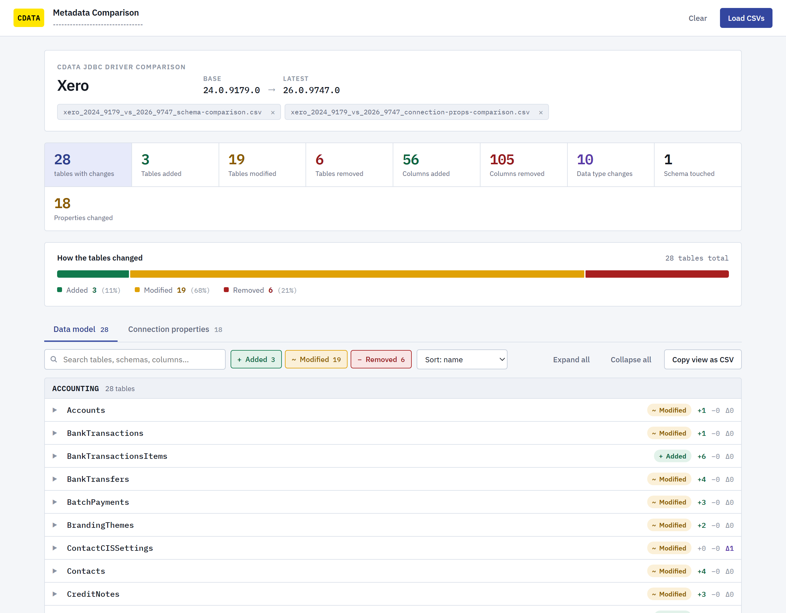

# CData JDBC Driver Metadata Comparison

Compares what two CData JDBC drivers actually expose tables, columns, data
types, and connection properties by connecting to both jars and diffing their
live metadata. An upgrade decision then rests on what the drivers really do,
rather than on release notes.

Packaged as a Claude Code skill, but every script runs standalone from a shell.

---

## What it compares

| Mode | Compares | Answers |
| --- | --- | --- |
| `schema` | two driver versions | Which tables and columns were added, removed, or retyped between builds? |
| `props` | two driver versions | Which connection properties changed between builds? |
| `cross-schema` | two schemas of one build | How does one schema's data model differ from another's? |

`cross-schema` exists for drivers that front a versioned API and serve one data
model per schema  Shopify's `GRAPHQL-2025-07` / `GRAPHQL-2026-01`, Exchange's
`EWS` / `MSGraph`, Xero's `ACCOUNTING` / `PAYROLLAUS`.

Note: The skill finds the jar automatically if no path is provided.

## The report

Every comparison writes a CSV, and `build_report.py` bakes those rows into a
standalone HTML page that opens in your browser. No server, no CSVs beside it,
no driver installed  one file you can email to someone who has none of those.



Search, filter by change type, filter by schema, sort, and expand any table to
its added, removed, retyped and re-cased columns. Both comparisons from one run
land in the same file as two tabs.

`assets/viewer.html` is the same page with an empty file picker and
drag-and-drop, for browsing CSVs from earlier runs.

---

## Requirements

- **JDK 11+**  `DumpMetadata.java` runs on the single-file source launcher, so
  there is nothing to compile and no third-party jar to fetch.
- **Python 3.8+**  standard library only.
- CData JDBC driver **v22 or above** on both sides.

---

## Two things worth understanding

### The cache is what makes this fast

A driver build is immutable, so a dump of it never goes stale. Dumps land in
`cache/` as `<driver>_<year>_<build>[_<schema>]_<mode>.csv`, and a later
comparison against that same build reuses the file instead of reconnecting.

**A comparison whose two sides are both cached needs no connection string, no
credentials, and no network.** That is the normal case after a build has been
dumped once, and it turns a multi-minute job into an instant one. `--refresh`
forces a re-dump if a cached file is ever suspect.

`cache/` holds live account metadata. Don't commit it, and don't ship it when
you export the skill.

### Connection strings are never written down

They carry credentials, so `DumpMetadata.java` reads the connection string from
**stdin**  never a file, never a command-line argument where the process list
exposes it to everything else on the machine. Stdin also sidesteps shell
quoting, and connection strings are full of `;`, `=`, `'` and spaces.

The `.meta.json` sidecar beside each dump records driver identity only: jar
path, driver class, version. Never connection details.

---

## What the report suppresses, and why

Three classes of difference are real in the data but meaningless as findings.
Left in, they bury the changes that matter.

**Boolean spelling.** Driver generations disagree on `false` versus `False`. On a
real Oracle Eloqua 24 → 26 run, 14 properties showed a "default value change" and
10 were pure capitalization  enough noise to hide
`ValidateStoredProcedureParameters` genuinely flipping `False → True`. These are
folded out and counted on their own row.

**Re-cased identifiers.** Names are matched case-insensitively, so a column or
property whose spelling changed is reported as a rename rather than one removal
plus one addition. Exchange 26.0.9655 spells a `Contacts` field `DisplayName` in
EWS and `displayName` in MSGraph  33 fields in one table that would otherwise
read as 33 breaking removals.

**Account-derived tables.** Many drivers expose tables generated from the
connected account  Eloqua `Form_*`, custom objects, anything a user defines at
runtime. Those move when someone edits the account, not when the driver changes.
Before calling a removed table a regression, check whether its siblings
survived: if 71 of 72 `Form_*` tables are in both dumps, one form was deleted.

## Reading the output

`Removed` tables and columns, and `Removed` connection properties, break what
works today. Data type changes are next  they surface as wrong values or cast
failures at query time, with no error on connect. Default value changes on
connection properties shift behavior with no signal at all. Additions are safe
by construction.

`references/output-format.md` documents every column in all three CSVs.

---

## Troubleshooting

`references/troubleshooting.md` covers failures with the exact messages they
produce. The most common by far is licensing: `props` reads fine on an
unlicensed jar, but `schema` needs a licensed connection to a live source. The
error names the paths it searched and carries a `nodeid:`  feed that to the
`cdata-trial-license-generator` skill, or supply an RTK in the connection string
via `Other="RTK=..."`.

## Layout

```
SKILL.md                      instructions for Claude Code
README.md                     this file
assets/viewer.html            the report page, with a bundled PayPal sample
scripts/find_driver.py        driver name + version -> jar path, via jar manifests
scripts/DumpMetadata.java     loads one jar, dumps sys_tablecolumns / sys_connection_props
scripts/compare_dumps.py      diffs two dumps -> CSV + on-screen counts
scripts/build_report.py       bakes CSVs into a standalone HTML report and opens it
references/output-format.md   every column in every output, and how to read it
references/troubleshooting.md real failure messages and their causes
```

One jar per `DumpMetadata` invocation, deliberately. Loading two versions into
one JVM leaves `DriverManager` choosing between drivers that both claim the same
`jdbc:` subprotocol, and it does not always choose the one you meant.
